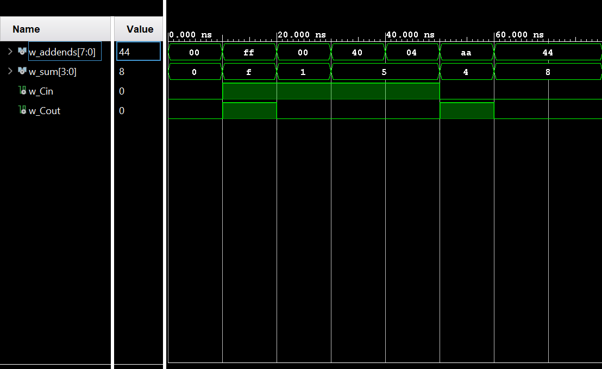

# ECE 281 ICE 3: Ripple-Carry Adder with Top Level Design

## Waveform

This is a **template** repository.

## Documentation
I used microsoft paint to draw my sketch for the entity. I referenced ICE4 sketch of entity schematic to draw it similarily. No other help received.

[ICE 3 instructions](https://usafa-ece.github.io/ece281-book/ICE/ICE3.html)

Targeted toward Digilent Basys3. Make sure to install the [board files](https://github.com/Xilinx/XilinxBoardStore/tree/2018.2/boards/Digilent/basys3).

Tested on Vivado 2024.2

---

## GitHub Actions Testbench

The workflow uses the [setup-ghdl-ci](https://github.com/ghdl/setup-ghdl-ci) GitHub action
to run a *nightly* build of [GHDL](https://ghdl.github.io/ghdl/).

First, the workflow uses GHDL to **analyze** all `.vhd` files in `src/`.

Then it **elaborates** the entity defined by `$TB_ENTITY`

Finally, the workflow **runs** the simulation. If successful then it will quietly exit with a `0` code.
If any of the `assert` statements fail then GHDL will cease the simulation and exit with non-zero code; this will also cause the workflow to fail.
Assert statements of other severity levels will be reported, but not fail the workflow.
